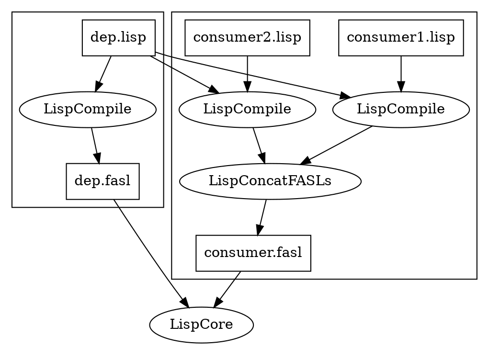
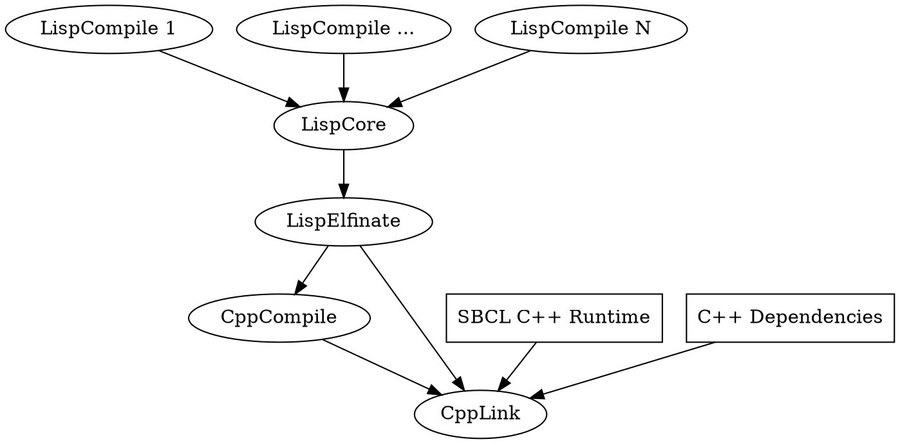

# Bazel Common Lisp Build Rules

This project contains build rules and toolchain for building Common Lisp code
with SBCL using Bazel.

These rules are intended to be
compatible with the latest released version of Bazel, currently 4.2.1.

See also the full
[Stardoc generated documentation](doc/rules.md)
for `lisp_library`, `lisp_binary`, and `lisp_test`.

## Build structure

The general structure of the actions for these build rules is:

*   `LispCompile`: All libraries are built in parallel, loading transitive Lisp
    source files (*not* FASL outputs) for their dependencies, producing a single
    combined FASL for each target's `srcs`.
*   `LispCore`: All the FASLs are loaded and a core file is written with
    `save-lisp-and-die`.
*   `LispElfinate`: The core is split into a file containing assembly code
    representing the compiled Lisp code and an object file containing the
    remainder of the Lisp image.
*   `CppCompile`: The assembly code is reassembled.
*   `CppLink`: Everything is linked together with any C++ dependencies (from
    `lisp_*.cdeps`) and the SBCL runtime to produce an ELF-format binary.

### Compilation

`lisp_library`, `lisp_binary`, and `lisp_test` generate `LispCompile` actions
for each file in `srcs`.

Before compilation, the compilation `image` loads all of the `srcs` of the
targets' transitive `deps`. Note that this means `lisp_library` targets do not
depend on the output of their `deps`, so a `lisp_library` target and its `deps`
may be compiled in parallel.

If a target has multiple files in `srcs`, other files in `srcs` may also be
loaded, depending on the value of `order`:

*   `"serial"` (the default): Previous files in `srcs` are loaded in order. If
    multiple files must be loaded in order, it is recommended to add a comment
    noting this to the top of the target's `srcs` in the BUILD file, so that the
    order is not inadvertently changed by editors or automatic formatters. If
    files in `srcs` do not depend on one another, setting `order` to
    `"parallel"` avoids unnecessary work.
*   `"parallel"`: No other files in `srcs` are loaded.
*   `"multipass"`: All files in `srcs` are loaded. This can be necessary when
    there are circular compile-time dependencies between files, but should be
    avoided when possible.

Note that "parallel", "serial", and "multipass" describe *dependency structure*,
not the parallelization of `LispCompile` actions. In all cases, the compilation
actions for the files in `srcs` can be performed in parallel.

Prior to loading dependencies, symbols are added to `*features*` to represent
some things about the build:

*   `:bazel` to distinguish this from other build systems
*   `:opt` if `--compilation_mode` (`-c`) is set to `opt`
*   `:dbg` if `--compilation_mode` is set to `dbg`
*   Features specified by the `add_features` attribute of the target and its
    Lisp dependencies

Dependencies are loaded with `#'load-file` with the *optimize qualities*:

`speed` | `debug` | `safety` | `space` | `compilation-speed`
------- | ------- | -------- | ------- | -------------------
1       | 1       | 1        | 1       | 3

After all dependencies are loaded, each compilation action compiles a file in
`srcs` into a FASL file with `#'compile-file`, with optimize qualities depending
on the setting of `--compilation_mode` (`-c`), which defaults to `fastbuild`:

`-c`        | `speed` | `debug` | `safety` | `space` | `compilation-speed`
----------- | ------- | ------- | -------- | ------- | -------------------
`fastbuild` | 1       | 2       | 3        | 1       | 1
`opt`       | 3       | 0       | 0        | 1       | 1
`dbg`       | 1       | 3       | 3        | 1       | 1

When run with the `coverage` command (or `--collect_code_coverage`), the
optimize quality `sb-c:store-coverage-data` is also set to 3.

Default outputs and runfiles from a target's `compile_data` and the
`compile_data` of its transitive Lisp dependencies are provided as additional
inputs to the `LispCompile` action.

If there is at least one file in `srcs`, the FASLs are concatenated into
`[name].fasl`, which is the default output for `lisp_library`. If there are
multiple files in `srcs`, this requires an additional `LispConcatFASLs` action.
A `lisp_library` with no `srcs` has no default outputs.

### Executable generation

For `lisp_binary` and `lisp_test` rules, the rule also generates an executable
output, which is the default output for those rules. By default, that executable
runs the function or code specified in the `main` attribute (which can be
overridden by `LISP_MAIN`). That defaults to `cl-user::main`.

Executable generation happens in several actions. First, `LispCore`:

*   Loads all of the combined FASLs for each target in the target's transitive
    `deps`, as well as the one for the target itself.
*   Binds `bazel.main::*entry-point*` to the function specified in `main` (or a
    newly-generated function which executes the code specified in `main`, if
    `main` contains a snippet of code instead of a single symbol name).
*   Generates a Lisp core file with `#'sb-ext:save-lisp-and-die`, specifying the
    `:toplevel` function `bazel.main::restart-image`. That in turn runs the
    `main` function by default. If the environment variable `LISP_MAIN` is
    specified, it runs the function named by that (by default in the `cl-user`
    package) instead. `LISP_MAIN=t` or `LISP_MAIN=nil` starts the default
    REPL, as does setting LISP_MAIN to anything that does not name a defined
    function.

The core file is split up with in a `LispElfinate` action, then combined with
the transitive C++ dependencies (the SBCL runtime and dependencies provided to
the target and its transitive `deps` via `cdeps`) to generate an executable in a
`CppLink` action.

By default, the `LispElfinate` action splits the core file into a `.s` file
containing assembly for the compiled Lisp code and a `.o` file representing the
remainder of the Lisp core. The former is compiled with a `CppCompile` action,
then both are fed into `CppLink`.

The advantage of this approach is that the binary ends up in a standard ELF
format. This allows tools which analyze the call-stack of C++ code to get
human-readable stacktraces for combined C++ and Lisp code. While this obviously
won't let a C++ debugger step through Lisp code, it's useful for CPU profiling
and crash analysis.

The disadvantage of this approach is that the altered binary format is not
understood by `save-lisp-and-die`. Thus, if the `allow_save_lisp` attribute is
set to `True`, `LispElfinate` instead transforms the entire Lisp core into a
binary blob in a `.o` file plus a linker script informing the `CppLink` action
on how that should be linked. The result is technically ELF format, but the Lisp
portion is opaque. SBCL can operate on that Lisp portion with
`save-lisp-and-die`, making the executable suitable for use as a compilation
image.

## Legacy build variables

The rules provide a few legacy build variables, specified with `--define`, which
control these rules' behavior.

`LISP_COMPILATION_MODE` overrides `--compilation_mode` (`-c`) for `LispCompile`
and `LispCore` actions. For example, `-c opt
--define=LISP_COMPILATION_MODE=fastbuild` would run the build in `opt` mode,
except the `LispCompile` and `LispCore` actions would behave as they would in
`fastbuild` mode.

`LISP_BUILD_FORCE` runs `LispCompile` and `LispCore` actions that try to proceed
despite errors to the greatest extent possible.

`VERBOSE_LISP_BUILD` overrides the setting of the `verbose` attribute if set to
a higher value.

## Build debugging

When build steps fail, passing
[`--verbose_failures`](https://docs.bazel.build/versions/main/command-line-reference.html#flag--verbose_failures)
at the Bazel CLI will result in the full command-line being printed for the
failing actions. (Or
[`--subcommands`](https://docs.bazel.build/versions/main/command-line-reference.html#flag--subcommands)
can be used to print all action command-lines.)

When rerunning the command for a `LispCompile` or `LispCore` action locally,
the `--verbose` flag can be set to `3` to provide maximum debugging output.
The `--interactive` flag can also be passed to the compilation image to enable
the interactive debugger, which the compilation image disables by default.

## Providers and outputs

These rules
[provide](https://docs.bazel.build/versions/master/skylark/rules.html#providers)
`LispInfo` (defined in `provider.bzl`) to propagate information about Lisp
dependencies. `LispInfo.cc_info` contains a
[`CcInfo`](https://docs.bazel.build/versions/master/skylark/lib/CcInfo.html)
providing information about transitive C++ dependencies. `CcInfo` is not
provided directly, because the targets instantiated by these rules cannot be
used as C++ dependencies.

These rules also provide
[`OutputGroupInfo`](https://docs.bazel.build/versions/master/skylark/lib/OutputGroupInfo.html)
with a `fasl` field, containing the combined FASL file (`[name].fasl`) for the
target's immediate `srcs`, if `srcs` is non-empty. That is also the default
output
([`DefaultInfo.files`](https://docs.bazel.build/versions/master/skylark/lib/DefaultInfo.html#files))
of `lisp_library`. For `lisp_binary` and `lisp_test`, the default output is the
executable (same name as the target).

If the flag `--//:additional_dynamic_load_outputs` is
passed, `OutputGroupInfo` has the following additional fields:

*   `deps_manifest` additionally contains a plaintext representation of the
    target's transitive Lisp features (prefixed with `feature:`) and transitive
    source files (prefixed with `src:`).
*   `dynamic_library` contains a shared object file with the target's transitive
    C++ dependencies.

[Runfiles](https://docs.bazel.build/versions/master/skylark/rules.html#runfiles)
([`DefaultInfo.default_runfiles`](https://docs.bazel.build/versions/master/skylark/lib/DefaultInfo.html#default_runfiles))
are propagated from all dependencies that provide either runtime dependencies or
source files (`image`, `deps`, `cdeps`, `data`, `compile_data`, `srcs`) and
further populated from the default outputs of `data` and `compile_data`.
